# termsnap

> Record terminal sessions and export beautiful animated SVGs. One tool, two commands.

<p align="center">
  
</p>

The current tools for terminal recordings are either too complex (chaining asciinema + svg-term-cli), require learning a config language (vhs tape files), or produce blurry GIFs.

**termsnap** does it all in two commands with sharp, animated SVG output that renders natively on GitHub.

**[Try the web playground](https://cuteanimegirl1337.github.io/termsnap/)** — paste a `.cast` file and preview SVGs with different themes instantly.

---

## Quick Start

```bash
git clone https://github.com/CuteAnimeGirl1337/termsnap.git
cd termsnap
bun install
```

### Run directly

```bash
bun src/index.ts record -o demo.cast
bun src/index.ts export demo.cast -o demo.svg
```

### Install globally (use `termsnap` from anywhere)

```bash
bun build src/index.ts --outfile bin/termsnap.js --target bun
bun link
```

Then you can use it from any directory:

```bash
termsnap record -o demo.cast
termsnap export demo.cast -o demo.svg
termsnap snap -o demo.svg
```

> The first run auto-compiles a small C helper for terminal capture (requires `gcc`).

---

## Commands

### `termsnap record`

Records your terminal into a `.cast` file (asciicast v2 format — compatible with asciinema).

```bash
termsnap record -o demo.cast               # Default 80x24
termsnap record -o demo.cast -c 120 -r 30  # Custom size
termsnap record -o demo.cast -s fish       # Specific shell
```

Type `exit` or press `Ctrl+D` to stop recording.

### `termsnap export`

Converts a `.cast` file into an animated SVG.

```bash
termsnap export demo.cast                          # Output: demo.svg
termsnap export demo.cast -o output.svg            # Custom output path
termsnap export demo.cast --theme dracula          # Use a theme
termsnap export demo.cast --speed 2                # 2x playback speed
termsnap export demo.cast --max-idle 1             # Cap pauses to 1 second
termsnap export demo.cast --title "my demo"        # Text in the title bar
termsnap export demo.cast --crop                   # Trim empty rows from bottom
termsnap export demo.cast --no-window              # No window chrome
termsnap export demo.cast --still                  # Static screenshot (last frame)
termsnap export demo.cast --font-size 16           # Larger text
```

### `termsnap snap`

Record + export in one step. Supports all `export` flags.

```bash
termsnap snap -o demo.svg
termsnap snap -o demo.svg --theme catppuccin --speed 1.5
```

### `termsnap preview`

Play back a recording in the terminal (like `asciinema play`).

```bash
termsnap preview demo.cast                # Real-time playback
termsnap preview demo.cast --speed 3      # 3x speed
termsnap preview demo.cast --max-idle 1   # Cap pauses
```

### `termsnap themes`

List all available color themes.

---

## Themes

8 built-in themes. Use `--theme <name>` with `export` or `snap`.

| Theme | Preview |
|-------|---------|
| `one-dark` | Default. Atom's One Dark |
| `dracula` | Popular dark purple theme |
| `catppuccin` | Catppuccin Mocha — pastel dark |
| `nord` | Arctic, north-bluish palette |
| `gruvbox` | Retro groovy dark theme |
| `light` | Clean light theme |
| `github-dark` | GitHub's dark mode colors |
| `tokyo-night` | Dark theme inspired by Tokyo lights |

```bash
termsnap export demo.cast --theme dracula
termsnap export demo.cast --theme catppuccin
termsnap export demo.cast --theme nord
```

---

## Output Features

- Animated SVG with CSS keyframes (no JavaScript)
- macOS-style window chrome with optional title bar text
- 8 color themes (One Dark, Dracula, Catppuccin, Nord, Gruvbox, Light, GitHub Dark, Tokyo Night)
- Full 256-color + RGB support
- Speed control and idle time capping
- Automatic frame deduplication (identical consecutive frames are merged)
- Crop mode to trim empty terminal rows
- Monospace font stack (JetBrains Mono, Fira Code, Cascadia Code, etc.)
- Renders natively on GitHub, GitLab, and any browser
- Tiny file sizes (typically 5-20 KB)

## How It Works

1. A small C program spawns a pseudo-terminal (PTY) and captures all output with microsecond timestamps
2. A TypeScript ANSI parser emulates the terminal state (colors, cursor movement, screen clearing)
3. An SVG renderer converts each frame into vector text with CSS animations

No Electron, no headless browser, no screen recording. Pure text-to-SVG.

## Requirements

- [Bun](https://bun.sh)
- `gcc` (for compiling the PTY helper on first run)
- Linux or macOS

## License

MIT
